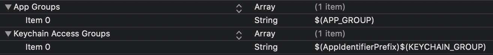
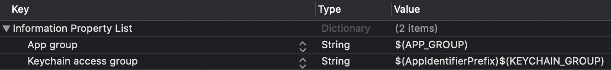

# Dialog OEM

Dialog OEM is a messaging library written in Swift.

## Requirements

* iOS 11+
* Xcode 12+
* Swift 5+

## Installation

Dialog OEM consists of 4 frameworks:

* Dialog.framework (for main application target) _required_
* DialogNotificationService.framework (for Notification Service extension) _optional_
* DialogShare.framework (for Share extension) _optional_
* DialogNotificationContent.framework (for Notification Content extension) _optional_

### CocoaPods

[CocoaPods](https://cocoapods.org/) is a dependency manager for Cocoa projects. For usage and installation instructions, visit their website. To add Dialog OEM frameworks into your Xcode project using CocoaPods, specify them in your `Podfile`:
```ruby
target 'Your App Main Target' do
    use_frameworks!
 
    pod 'Dialog', :git => 'git@github.com:dialogs/oem-ios.git', :branch => 'pre-release'
end
 
target 'Your App Notification Service Target' do
    use_frameworks!
 
    pod 'DialogNotificationService', :git => 'git@github.com:dialogs/oem-ios.git', :branch => 'pre-release'
end
 
target 'Your App Share Target' do
    use_frameworks!
 
    pod 'DialogShare', :git => 'git@github.com:dialogs/oem-ios.git', :branch => 'pre-release'
end
 
target 'Your App Notification Content Target' do
    use_frameworks!
 
    pod 'DialogNotificationContent', :git => 'git@github.com:dialogs/oem-ios.git', :branch => 'pre-release'
end
```

Dialog OEM frameworks are binary frameworks built without `BUILD_LIBRARY_FOR_DISTRIBUTION` support, so pay attention to Xcode version consistency.

Dialog.framework contains the following external dependencies:

* 'Alamofire', '4.8.2'
* 'BoringSSL', '10.0.6'
* 'Cache', '5.2.0'
* 'Differentiator', '4.0.0'
* 'FLAnimatedImage', '1.0.12'
* 'GRDB.swift/SQLCipher', '~> 4.14.0'
* 'gRPC', '~> 1.24'
* 'gRPC-Core', '~> 1.24'
* 'gRPC-ProtoRPC', '~> 1.24'
* 'gRPC-RxLibrary', '~> 1.24'
* 'KeychainAccess', '3.2.0'
* 'nanopb', '0.3.901'
* 'ObjcExceptionBridging', '1.0.1'
* 'PhoneNumberKit', '2.5.1'
* 'PINCache', '3.0.1'
* 'PINOperation', '1.2.0'
* 'PINRemoteImage', '3.0.1'
* 'Protobuf', '3.13.0'
* 'ReachabilitySwift', '5.0.0'
* 'RSKImageCropper', '2.2.2'
* 'RxAlamofire', '5.0.0'
* 'RxAnimated', '0.7.0'
* 'RxBiBinding', '0.2.5'
* 'RxCocoa', '5.1.1'
* 'RxDataSources', '4.0.1'
* 'RxGesture', '3.0.2'
* 'RxKeyboard', '1.0.0'
* 'RxSwift', '5.1.0'
* 'RxSwiftExt/Core', '5.2.0'
* 'RxTheme', '4.0.0'
* 'RxWebKit', '1.0.0'
* 'SnapKit', '5.0.1'
* 'SQLCipher', '~> 4.0'
* 'SwiftDate', '6.0.3'
* 'SwiftGRPC', '0.11.0'
* 'SwiftProtobuf', '1.7.0'
* 'Swinject', '2.7.1'
* 'TrustKit', '1.6.3'
* 'ViewAnimator', '2.7.0'
* 'XCGLogger/UserInfoHelpers', '7.0.1'

and fork dependencies (binary frameworks that CocoaPods automatically adds to your project when installing Dialog.framework):

* 'Dialog-gRPC-Objc', :git => 'git@github.com:dialogs/api-schema.git', :branch => 'feature/objc_support'
* 'DialogCalls-GRPC', :git => 'git@github.com:dialogs/server-api-calls-sdk.git', :tag => '2.19.0'
* 'DialogSDK-GRPC', :git => 'git@github.com:dialogs/api-schema.git', :tag => 'v1.76.0'
* 'DialogWebRTC', :git => 'git@github.com:dialogs/dialog-webrtc-ios-pod.git', :tag => '27.08.2020-15-07'
* 'DLGPicker', :git => 'git@github.com:dialogs/Alerts-Pickers', :tag => '1.0.43'
* 'Emoji-swift', :git => 'git@github.com:safx/Emoji-Swift.git', :branch => 'master'
* 'InputBarAccessoryView', :git => 'git@github.com:nathantannar4/InputBarAccessoryView.git', :tag => '5.1.0'
* 'RxASDataSources', :git => 'git@github.com:dialogs/RxASDataSources', :tag => '1.0.0.1'
* 'RxCocoa-Texture', :git => 'git@github.com:jeffersonsetiawan/RxCocoa-Texture.git', :branch => 'texture3'
* 'Sentry', :git => 'git@github.com:getsentry/sentry-cocoa.git', :tag => '5.2.2'
* 'Sodium', :git => 'git@github.com:dialogs/swift-sodium.git', :tag => '0.8.1'
* 'Texture', :git => 'git@github.com:dialogs/Texture.git', :tag => '3.0.0.2'
* 'XCoordinator/RxSwift', :git => 'git@github.com:quickbirdstudios/XCoordinator', :tag => '2.0.7'

## Integration

### Dialog.framework

To integrate Dialog.framework please add the following code to your `AppDelegate`:
```swift
import UIKit
import Dialog

@UIApplicationMain
class AppDelegate: UIResponder, UIApplicationDelegate {
    
    var window: UIWindow?
    
    var badgeUpdateHolder: Any?
    var routeLoggingHolder: Any?

    func application(_ application: UIApplication, willFinishLaunchingWithOptions launchOptions: [UIApplication.LaunchOptionsKey: Any]? = nil) -> Bool {
        var sharedAccessConfig: DialogSharedAccessConfig?
        
        if let appGroup = Bundle.main.object(forInfoDictionaryKey: "App group") as? String, let keychainGroup = Bundle.main.object(forInfoDictionaryKey: "Keychain access group") as? String {
            sharedAccessConfig = DialogSharedAccessConfig(appGroup: appGroup, keychainGroup: keychainGroup)
        }

        Dialog.configure(
            with: Dialog.Config(endpoint: "grpc-oem-01.apps.sandbox.dlg.im", apnsAppId: 100101, sharedAccessConfig: sharedAccessConfig),
            style: DialogStyle(corporateColor: #colorLiteral(red: 0.5960784314, green: 0.5333333333, blue: 0.768627451, alpha: 1))
        )
        
        badgeUpdateHolder = NotificationCenter.default
            .addObserver(forName: Dialog.DialogDidUpdateBadgesStateNotification, object: nil, queue: .main, using: { notification in
                let userInfoKey = Dialog.BadgesState.notificationUserInfoKey
                var result = 0
                        
                if let state = notification.userInfo?[userInfoKey] as? Dialog.BadgesState {
                    result = state.unreadDialogs
                }
                        
                UIApplication.shared.applicationIconBadgeNumber = result
            })
        
        routeLoggingHolder = NotificationCenter.default
            .addObserver(forName: .DialogCoordinationNotification, object: nil, queue: nil, using: { notification in
                let key = Notification.DialogCoordinationUserInfoRouteKey
                
                if let route = notification.userInfo?[key] as? DialogGlobalRoute {
                    print("Dialog routed to \(route)")
                } else {
                    print("Dialog posted a route notification with invalid user info \(notification.userInfo ?? [:])")
                }
            })
        
        return true
    }
    
}
```

`Dialog.Config` init supports the following arguments:
```swift
public init(
    endpoint: String,
    apnsAppId: Int32? = nil,
    sharedAccessConfig: Dialog.DialogSharedAccessConfig? = nil,
    needEnableCallsIntents: Bool = false,
    defaultFeatureFlags: [DialogProtocols.DialogFeatureFlag] = []
)
```

where

* `endpoint` — your app login endpoint
* `apnsAppId` — project ID for push notifications
* `sharedAccessConfig` — see extension frameworks integration sections, use default value in case of no extension framework
* `needEnableCallsIntents` — use default value
* `defaultFeatureFlags` — use default value

#### Login/logout

For correct login/logout procedure please call
```swift
Dialog.shared.loginWith(token: token, completion: { _ in })
```

when login and
```swift
Dialog.shared.logout(completion: { _ in })
```

when logout.

### DialogNotificationService.framework

To integrate DialogNotificationService.framework please do the following:

1. Generate push certificate.

2. Add the configuration (certificate + project ID for push notifications) to server.

3. Add the same items for `App Groups` and `Keychain Access Groups` to the main target and Notification Service target entitlements. The following example uses Xcode Environment Variables for that (optionally, for convenience):



The same Environment Variables could be added to `Info.plist`s of the main target and Notification Service target (optionally, but used below for convenience):



4. Fill `DialogSharedAccessConfig` and pass project ID for push notifications to `Dialog.Config` init (see Dialog.framework integration):
```swift
var sharedAccessConfig: DialogSharedAccessConfig?

if let appGroup = Bundle.main.object(forInfoDictionaryKey: "App group") as? String, let keychainGroup = Bundle.main.object(forInfoDictionaryKey: "Keychain access group") as? String {
    sharedAccessConfig = DialogSharedAccessConfig(appGroup: appGroup, keychainGroup: keychainGroup) }

Dialog.configure(
    with: Dialog.Config(endpoint: "grpc-oem-01.apps.sandbox.dlg.im", apnsAppId: 100101, sharedAccessConfig: sharedAccessConfig),
    style: DialogStyle(corporateColor: #colorLiteral(red: 0.5960784314, green: 0.5333333333, blue: 0.768627451, alpha: 1))
)
```

5. Proxy `AppDelegate` methods:
```swift
func application(_ application: UIApplication, didRegisterForRemoteNotificationsWithDeviceToken deviceToken: Data) {
    Dialog.shared.application(application, didRegisterForRemoteNotificationsWithDeviceToken: deviceToken)
}

func application(_ application: UIApplication, didFailToRegisterForRemoteNotificationsWithError error: Error) {
    Dialog.shared.application(application, didFailToRegisterForRemoteNotificationsWithError: error)
}

func application(_ application: UIApplication, didReceiveRemoteNotification userInfo: [AnyHashable: Any], fetchCompletionHandler completionHandler: @escaping (UIBackgroundFetchResult) -> Void) {
    if Dialog.shared.canHandlePushNotificationWith(userInfo: userInfo) {
        Dialog.shared.application(application, didReceiveRemoteNotification: userInfo, fetchCompletionHandler: completionHandler)
    }
}
```

6. Register for push notifications receiving by calling `registerForPushNotifications` method after login to Dialog:
```swift
Dialog.shared.registerForPushNotifications()
```

To unregister from push notifications receiving call `unregisterForPushNotifications` method:
```swift
Dialog.shared.unregisterForPushNotifications()
```

7. Conform `UNNotificationServiceExtension` protocol in Notification Service extension:
```swift
import UserNotifications
import DialogNotificationService

class NotificationService: UNNotificationServiceExtension {
    
    override func didReceive(_ request: UNNotificationRequest, withContentHandler contentHandler: @escaping (UNNotificationContent) -> Void) {
        guard let appGroup = Bundle.main.object(forInfoDictionaryKey: "App group") as? String, let keychainGroup = Bundle.main.object(forInfoDictionaryKey: "Keychain access group") as? String else {
            contentHandler(request.content)
            return
        }
        
        if DialogNotificationService.shared.canHandle(request) {
            DialogNotificationService.configure(with: DialogSharedAccessConfig(appGroup: appGroup, keychainGroup: keychainGroup))
            DialogNotificationService.shared.didReceive(request, withContentHandler: contentHandler)
        } else {
            contentHandler(request.content)
        }
    }
    
    override func serviceExtensionTimeWillExpire() {
        DialogNotificationService.shared.serviceExtensionTimeWillExpire()
    }

}
```